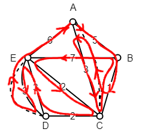

# Definitions

**Definition (walk, path, circuit):** A _walk_ in a graph is a set  of consecutive edges. A _path_ in a graph is a set of **different** consecutive edges. If the starting point and end point are the same in a path, the path is called a _circuit_.

**Definition (connected):** A graph G is called _connected_, if there is a path between every pair of vertices in G.

**Definition (Eulerian graph/circuit):** A graph G is called an _Eulerian_ graph, if there is a circuit in G which contains every edge in G. Such a circuit is called an _Eulerian circuit_.

**Theorem (necessary and sufficient condition):** If G is connected, the following holds: 
 * G is an Eulerian graph <=> All vertices in G have an even degree.

# Chinese postman problem (CPP)

The [Chinese postman problem](https://en.wikipedia.org/wiki/Route_inspection_problem) is to find the lightest tour along all edges in a connected graph. Formulating the question in Graph Theory, we get:

> Find an Eulerian circuit in G.

To find an Eulerian circuit, G must be an Eulerian graph. This means the following two cases can happen: 
 1. If G is already an Eulerian graph, we find any Eulerian circuit.
 2. If G is not an Eulerian graph, we will have to add the lightest edges to G, until G contains an Eulerian circuit.

## Example

Let G be the following graph:

We can see that the vertices with an odd degree are: ABDE. Because not all vertices have an even degree, this is not an Eulerian graph. To change G into an Eulerian graph, we have to add atleast two edges.

First we will make a list with all possible pairs we can make from ABDE. We will denote the pair with a * if it is not a direct path.

|Pair|Weight|
|-|-|
AB*-DE|3+1+3=7|
AD*-BE*|5+1+2=8|
AE*-BD*|3+2+3=8|

We can see that if we add AB-DE, the total weight of the path will increase by 7.

The total weight of the path is the sum of all the edges, because this is an Eulerian circuit. This means that the total weight + additional weight is 32 + 7 = 39.

The path is an Eulerian circuit, such as: ABCACBECDEDEA.

## Notes

For bigger problems, we can use Dijkstra's shortest path algorithm to determine the shortest path for all pairs.

To find the number of pairs, for example when there are 10 odd degree vertices, it is 9 x 7 x 5 x 3 x 1 = 945 pairs. In the case of the example problem, there are 4 odd degree vertices, there are a total of 3 x 1 = 3 pairs.